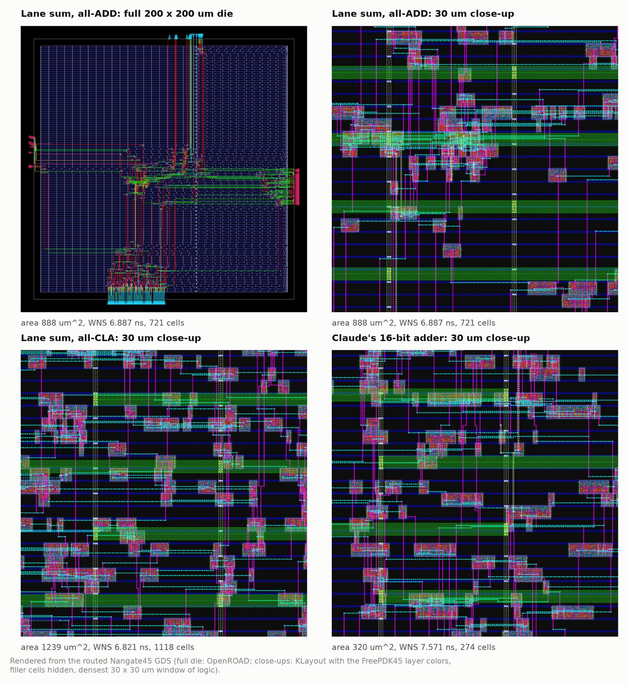

# Chip-RL: a verified RL environment for RTL optimization

Chip-RL turns a Verilog file into a verified reward: each candidate is simulated, proven equivalent to a reference with formal methods, and only then taken through a full open-source RTL-to-GDS flow (Yosys, OpenROAD, Nangate45) and scored on post-route timing and area. On top of that evaluator it provides a query-budgeted RL environment, several policy-gradient learners with frozen controls, and a tool-using agent environment for Claude. I used it to run preregistered experiments on 1,752 routed designs across 15 benchmarks.


## Key results

- **Reward hacking caught on day one.** Under a loose testbench, every spec-violating adder outscored its correct twin by dropping the output-hold logic (10 to 15% less area). Sequential formal equivalence now gates every reward. ([details](docs/RESULTS.md#11-the-day-one-reward-hack))
- **Formal verification that scales.** Proving a 16-lane adder tree against a sequential reference ran over 70 minutes without a result, and three modern SAT solvers could not solve its CNF in 120 s. A decomposed proof (cut points plus a 47-step machine-checked rewrite certificate) takes 0.38 s per design and still rejects 7/7 injected bugs. ([details](docs/RESULTS.md#13-verification-that-scales))
- **A cheap proxy for place-and-route.** Across 1,752 routed designs in 15 benchmarks, a floorplan-stage timing estimate ranks designs with median Spearman 0.97 against the final routed score at 15% of the flow's tool time. It is a screen, not an oracle: it ranked the project's best adder 40th of 116 because that design loses less delay to wiring, while screening after global placement kept the true best in every benchmark. Synthesis area alone has median rho 0.00. ([details](docs/RESULTS.md#4-how-early-can-the-final-score-be-predicted))
- **RL results that survive controls.** A hierarchical REINFORCE policy improved 3/3 fresh adder widths where a factorized one improved none, but frozen-policy controls showed learning itself added nothing (2 better, 2 worse, 5 tied; later 0 of 6). I found and fixed a policy-gradient bias from rejection sampling (verified to 4.5e-10) and traced the real bottleneck to search coverage. ([details](docs/RESULTS.md#3-reinforcement-learning))
- **Agentic RTL optimization.** In 72 preregistered episodes, Claude Haiku 4.5, Sonnet 5 and Opus 5 got simulation, formal, estimate and budgeted place-and-route tools. Cheap tools raised the share of episodes that beat the baseline by more than the noise floor from 9 of 36 to 15 of 36, mostly for the weaker models. Opus wrote strong datapath designs, including popcount trees up to +2.020 and a Ling adder that beat all prior search, and calibrated the reward with logic-free probe designs before optimizing. ([details](docs/RESULTS.md#6-agentic-claude-eval))
- **A capable agent found a hole in the spec.** Opus's top score (+5.008, about 2.5 times the best registered design) came from retiming half of a popcount past the output register. It is provably correct and meets timing, but the task asked for a registered block, which the checkers never enforced. A netlist check flags it and nothing else. ([details](docs/RTL_GALLERY.md#4b-designs-from-the-agentic-eval))
- **EDA throughput.** One verified evaluation takes a median of 23 s, 36% of it fixed container and tool-launch overhead. Sixteen parallel workers reach 691 designs per hour (4.6x one worker) with identical results at every worker count. ([details](docs/RESULTS.md#5-eda-latency-and-throughput))
- **A measured noise floor.** Comment-only edits left 13 of 14 designs bit-identical, and every claimed ranking held in every format. The agents found the noise anyway: edits that leave the synthesized netlist unchanged still moved scores by -0.087 to +0.030 through placement, so the agent results count scores inside that band as ties. ([details](docs/RESULTS.md#14-how-much-of-a-score-is-formatting))



## Quick start

```bash
. .venv/bin/activate                                   # Python 3.12, see docs/REPRODUCE.md for setup
python -m chiprl.demo                                  # one-minute tour: simulate, prove, counterexample, score
python -m chiprl.evaluate rtl/cmp32/baseline.v --benchmark cmp32
pytest -q tests/                                       # formal soundness suite
python -m experiments.agentic_rtl_eval_v1 --models claude-sonnet-5 --tasks cmp32 --conditions full_tools
```

## Documentation

| Document | Contents |
|---|---|
| [ARCHITECTURE.md](docs/ARCHITECTURE.md) | Evaluator, verification design, benchmarks, RL environment and policies, agent environment |
| [RESULTS.md](docs/RESULTS.md) | Every study with numbers and figures |
| [JOURNEY.md](docs/JOURNEY.md) | How the project evolved, day by day, and why |
| [RTL_GALLERY.md](docs/RTL_GALLERY.md) | Annotated RTL: adders, carry-lookahead trees, the reward hack, proof certificate steps |
| [INTERVIEW_GUIDE.md](docs/INTERVIEW_GUIDE.md) | Pitches, numbers, and deep technical Q&A |
| [RESUME.md](docs/RESUME.md) | Resume bullets and project summary |
| [REPRODUCE.md](docs/REPRODUCE.md) | Setup, experiment index, commands |

## Repository map

```
chiprl/        evaluate.py (the reward), formal.py and formal_tree_v1.py (equivalence),
               generators, rl_env.py, policies, agentic_env.py (tools for Claude)
experiments/   one protocol, runner and amendment set per study, in chronological order
analysis/      cross-study analyses and figure scripts
tests/         formal soundness tests
rtl/ sim/ orfs/  designs, references, testbenches, OpenROAD configs
results/       frozen records (evaluations/, rl_runs/, per-study folders)
docs/          documentation and figures
```

**Stack:** Verilog/SystemVerilog, Verilator, Yosys (formal equivalence, synthesis), OpenROAD-flow-scripts (placement, CTS, routing, OpenSTA), Nangate45, KLayout, Docker, Python, Claude API.
