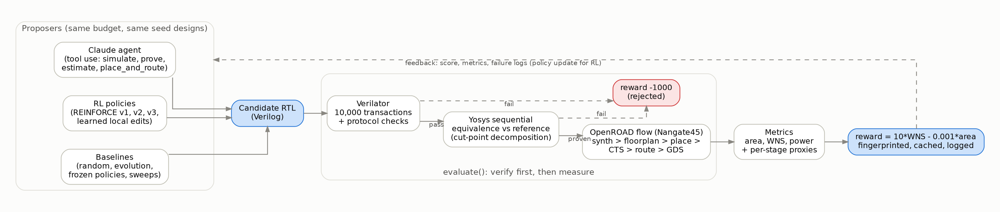

# Architecture

How Chip-RL turns a Verilog file into a trustworthy reward, and how search policies and agents use it.



## 1. The evaluator: verify first, then measure

`chiprl/evaluate.py` exposes one function:

```python
result = evaluate("rtl/cmp32/baseline.v", benchmark="cmp32")
# {"functional": True, "formal_ok": True, "place_route_ok": True,
#  "area": 268.926, "wns": 7.62112, "power_w": 2.2e-05, ...,
#  "proxy_reward_v0": 75.942274, "cache_hit": False, "evaluation_id": "..."}
```

It runs three gates in order and stops at the first failure, so expensive physical design only runs on correct RTL.

| Stage | Tool | What it checks | Typical time |
|---|---|---|---|
| 1. Simulation | Verilator 5.020 | Reset values, edge cases, 10,000 random valid transactions, an invalid cycle with changed inputs after each one (output must hold), back-to-back transactions. The 8-bit adder is checked exhaustively (65,536 pairs). | 4 s (mostly C++ compile) |
| 2. Formal equivalence | Yosys 0.68 | Sequential equivalence with an independent reference module: `proc; opt; equiv_make; equiv_simple -seq 4; equiv_induct -seq 4; equiv_status -assert` | 0.2 to 0.4 s (5 s for a 64-input popcount) |
| 3. Physical design | OpenROAD-flow-scripts, Nangate45 | Yosys/ABC synthesis, floorplan, placement, clock tree synthesis, global and detailed routing, GDS, signoff metrics | 15 to 25 s |

**Reward** (`proxy_reward_v0`): `10 * WNS_ns - 0.001 * area_um2` for a verified, routed design. Failures get fixed penalties: -1000 for a simulation or formal failure, -500 for a place-and-route failure. WNS is the worst setup slack at a 10 ns clock; area is total standard-cell area including tap cells and timing-repair buffers. The weighting makes 1 ps of slack worth 10 um^2 of area, so the reward is timing-dominated. `fmax` and power are recorded but never optimized (power has no switching-activity model).

**Fixed physical conditions.** Every candidate of a benchmark uses the same floorplan (for example a 100 x 100 um die for the 32-bit families, 200 x 200 um for the lane sum), 20% I/O delay budgets on a 10 ns clock, target placement density 0.20, the same power grid, and `SYNTH_REPEATABLE_BUILD=1`. Only the RTL changes.

**Determinism and caching.** Each evaluation gets an ID: the SHA-256 of the RTL, testbench, reference, ORFS config, SDC, formal depth, Docker image ID, ORFS commit and Verilator version. Results are cached under `results/evaluations/<benchmark>/<id>.json` and every ORFS run has its own directory (`FLOW_VARIANT=eval_<id>`). The flow is bit-reproducible for identical files: repeated uncached runs, a run one day later and runs with 1 to 16 parallel workers return identical metrics. It is not invariant to formatting: comments that shift line numbers changed the result of 1 of 14 designs in the noise study ([RESULTS.md](RESULTS.md#14-how-much-of-a-score-is-formatting)).

## 2. Verification design

**Why formal equivalence and not just more tests.** On day one a random search over 8-bit adder implementations found that the highest-scoring designs dropped the output-hold enable. The first testbench never changed inputs on invalid cycles, so it could not see the bug. Every spec-violating variant beat its correct twin by 10 to 15% area. A stricter testbench fixed that instance; sequential equivalence against a reference makes the whole class of bug impossible to score. The reward hack is also a mutation test in `tests/test_formal_tree_v1.py`.

**Decomposed proofs for reduction trees** (`chiprl/formal_tree_v1.py`). The lane-sum reference accumulates sixteen 8-bit lanes one at a time, while candidates reduce them with a balanced tree. The two circuits share no internal signals, so a monolithic SAT proof must re-derive associativity of addition at the bit level. It did not finish in 70 minutes, and the same 12,347-variable CNF defeats MiniSat, Glucose and CaDiCaL for 120 s each. The fix keeps the same Yosys commands and changes only the decomposition:

1. **Per candidate**: prove `candidate == all-ADD tree`. Tree nodes have the same names (`n_<level>_<pos>`) in both, so `equiv_make` turns every node into a cut point and each node is proven locally (0.38 s median).
2. **Once per benchmark**: prove `reference == all-ADD tree` through 46 intermediate designs. Each adjacent pair differs by one rewrite: swap two operands of the accumulation chain (28 swaps sort the lane order) or rotate `(A+B)+C` into `A+(B+C)` (17 rotations reach the balanced tree). Nodes are named by the set of lanes they sum (`s_<bitmask>`), so every unchanged node is a cut point and each link is a three-operand proof. All 47 links prove in 5 s total. Node widths are exact, so no step relies on wrap-around.
3. **Transitivity**: every design has the same registers and reset values, so the two results give `candidate == reference`.

What "proven" means here is Yosys's definition: `equiv_simple` proves each matched signal from its input cone, and `equiv_induct` shows that designs agreeing on all matched signals for 4 consecutive cycles never diverge. The base case is identical reset behavior, which the testbench checks.

The certificate (`results/formal/lanesum16x8_tree_reassociation_certificate_v1.json`) stores the hash of every intermediate design, and a candidate proof is accepted only if the certificate endpoints match the frozen reference and structural reference. The test suite checks soundness with 7 realistic mutants (missing CLA generate term, OR instead of XOR, wrong lane slice, dropped carry-out, removed output hold, wrong reset value, stuck valid) plus a corrupted rewrite step: all are rejected in about a second. The method is sound but incomplete: RTL without the tree's node names falls back to a monolithic proof and times out rather than passing.

**Checker v2** (`chiprl/formal_v2.py`). The agentic eval found two ways the frozen checker rejects correct designs: Yosys's `proc` turns `case` lookup tables into ROMs that `equiv_make` cannot analyze, and the checker never flattens submodules. v2 runs `proc -norom` and `flatten`, classifies failures (not equivalent, unsupported construct, timeout), and on a failed proof runs a bounded check from reset that returns a concrete counterexample trace, which is the feedback an agent needs. It also explained a design that passed 10,000 simulated transactions but failed formal: `y_o` had no reset, hidden by Verilator's zero initialization of registers; v2 shows `gold.y_o = 0` and `gate.y_o = 0xffffffff` one cycle after reset. v1 stays frozen so completed studies remain comparable (`tests/test_formal_v2.py`).

## 3. Benchmarks and action spaces

Every benchmark is a registered module with the same protocol (`clk`, synchronous active-low `rst_n`, `valid_i`, `a_i`, `b_i`, `valid_o`, `y_o`, one-cycle latency, output holds when `valid_i` is low), an independent reference, a testbench and a frozen ORFS config (`chiprl/benchmarks.py`).

| Family | Widths | Action | Space | Generator |
|---|---|---|---|---|
| Pipelined adder `addpipe` | 8, 16, 24, 32, 36, 40, 48, 56 | Boundary mask: split the adder into blocks; each block precomputes sums for carry-in 0 and 1 and a mux selects (variable-block carry-select) | 2^(W-1) | `chiprl/generate_addpipe*.py` |
| Comparator, popcount, priority encoder (`cmp32`, `popcount32`, `priority32`) | 32 | Segment mask: per-segment compare, count or encode, then combine | 2^31 | `chiprl/circuit_family_generators.py` |
| Popcount tree | 16, 32, 64 | One bit per node of a balanced reduction tree: plain `+` (ADD) or explicit carry-lookahead generate/propagate equations (CLA) | 2^15, 2^31, 2^63 | `chiprl/popcount_tree_widths_v1.py` |
| Lane-sum tree (sum of sixteen 8-bit lanes, the accumulation tree of an INT8 dot product) | 16 x 8 | Same ADD/CLA node grammar | 2^15 | `chiprl/lane_sum_tree_v1.py` |
| Open RTL | any | Arbitrary Verilog written by an LLM agent | unbounded | `chiprl/agent_env*.py`, `chiprl/agentic_env.py` |

Before an RL study uses a new grammar, a preregistered **physical diversity gate** measures 8 fixed designs and requires at least 4 distinct area/WNS signatures, 3 distinct areas, 1% area spread and 0.10 reward spread. This gate exists because the original popcount grammar turned out to be degenerate: 142 distinct masks produced only 3 physical outcomes.

## 4. RL environment and policies

`chiprl/rl_env.py` wraps the evaluator as a query-budgeted environment (`StructuralMaskEnv`): an action is a complete mask, duplicates are rejected before any EDA and cost nothing, every unique query costs one unit of budget whatever its outcome, and the step reward is the increase in best-so-far reward (so the episode return telescopes to final best minus seed best). State is saved after every query, so runs resume after interruption and can be replayed exactly.

| Policy | Idea | File |
|---|---|---|
| Random, evolution | Uniform unseen masks; tournament selection (size 3) with 1 to 3 bit-flip mutation and 15% random restarts | `experiments/addpipe*_structural_search.py` |
| REINFORCE v1 | Independent Bernoulli per mask bit, initialized from the seed designs, EMA baseline, clipped advantage | `experiments/addpipe32_reinforce.py` |
| REINFORCE v2 | Hierarchical: sample the boundary count K from a categorical, then K ordered positions; shared position logits | `chiprl/autoregressive_policy.py` |
| REINFORCE v3 | v2 with the exact gradient of the rejection-conditioned distribution (below) | `chiprl/conditioned_policy_gradient.py` |
| Local edit policy | Softmax over the unseen one-bit edits of the current best design, 10 structural features per node, exact conditional gradient | `chiprl/learned_local_edit_v1.py` |
| Frozen controls | Identical initialization and random streams, no updates | same files, `update` disabled |
| Claude (restricted) | Chooses the next mask from the observed results | `adapters/claude_addpipe*_structural.py` |

**The rejection-sampling gradient bug (v2 to v3).** v2 resamples until it draws a mask it has not evaluated, so proposals come from `q(m) = p(m) / (1 - P(S))` over unseen masks, where `S` is the evaluated set. v2's update used `grad log p(m)`. The correct score is

```
grad log q(m) = grad log p(m) + sum_{s in S} p(s) grad log p(s) / (1 - P(S))
```

At initialization 41 to 50% of v2's probability sat on already-evaluated masks (up to 61% by the end of a run), so the bias was large. A clean way to see the bug: a valid score function has zero mean under its own sampling distribution. On exhaustively enumerated 3- to 5-bit mask spaces the corrected score has mean 1e-16, while the uncorrected one has a mean of norm 0.39 to 0.54, so the old update drifts even when every reward is equal. The corrected gradient matches finite differences to 4.5e-10, and the rejection sampler matches the conditional distribution within 0.006 over 12,000 draws (`experiments/audit_conditioned_policy_gradient_v1.py`).

## 5. Agentic environment

`chiprl/agentic_env.py` gives an LLM agent tools that mirror an engineer's loop, with very different costs:

| Tool | Cost | Returns |
|---|---|---|
| `simulate(rtl)` | about 4 s | PASS, first mismatch, or compile errors |
| `prove_equivalence(rtl)` | about 1 s | PROVEN, or the unproven signals |
| `estimate_ppa(rtl)` | about 6 s | Synthesis plus floorplan-stage area and WNS (a proxy with median rank correlation 0.97 to the final score) |
| `place_and_route(rtl)` | about 23 s, budget of 4 | Final verified score; re-runs simulation and formal first; failures still consume budget |
| `finish()` | | Ends the episode |

Physical numbers come from the same frozen evaluator, so agent results are directly comparable with every RL result. Candidate hygiene rejects `initial` blocks, system tasks, compiler directives, and extra modules before any tool runs. `experiments/agentic_rtl_eval_v1.py` runs the manual tool-use loop (adaptive thinking, prompt caching, append-only history), records every tool call, token count and dollar cost, and runs episodes in parallel with per-design file locks.

## 6. Research hygiene

- **Preregistration.** Each study commits a protocol (methods, seeds, budgets, metrics, SHA-256 of every source file) and a git tag before any measurement. Runners refuse to start if a hashed file changed. Pre-measurement fixes are recorded as amendments (`experiments/amendment_*.json`).
- **Controls.** Learning policies are compared with identically initialized frozen copies and with sparsity-matched samplers, so gains from initialization or sampling geometry are not credited to learning.
- **Audits.** Completed studies are replayed from saved records: policy actions, parameter updates and physical fingerprints must match.
- **Replication and noise.** Small improvements are re-measured uncached (for example the 1.33 ps one-flip improvement, 3/3 identical) and checked against a measured noise floor: the same design in five comment-only formats (`experiments/flow_noise_study_v1.py`).

## 7. Code map

```
chiprl/            evaluator, formal checkers, generators, policies, environments
experiments/       one runner, protocol and amendment per study (chronological)
analysis/          cross-study analyses and figure scripts
tests/             formal soundness tests (pytest)
rtl/ sim/ orfs/    RTL, testbenches, flow configs; rtl/reference holds the equivalence references
results/           frozen records: evaluations/, rl_runs/, per-study folders, analysis/
docs/              this documentation and figures/
```
