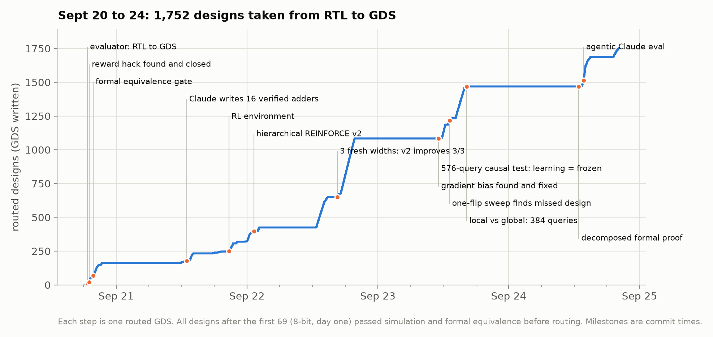

# Engineering journey

How the project evolved, in order, with the decision behind each step. Times are git commit times (Pacific). Every experiment has a protocol, a runner, frozen results and a git tag; see [RESULTS.md](RESULTS.md) for numbers and [REPRODUCE.md](REPRODUCE.md) for commands.

## Timeline

| When | Milestone | Outcome |
|---|---|---|
| Sept 20, afternoon | Toolchain bring-up | Verilator, Docker, OpenROAD-flow-scripts built locally (prebuilt image crashed with an AVX-512 illegal instruction), `gcd` smoke test to GDS |
| Sept 20, 18:44 | `evaluate()` v0 | One call runs simulation and the full RTL-to-GDS flow and returns area, WNS, power and a reward |
| Sept 20, 18:54 | First random search | Top-scoring 8-bit designs were spec violations |
| Sept 20, 19:04 | Loophole closed | Exhaustive testbench with output-hold and back-to-back checks |
| Sept 20, 19:28 | Full 48-design map | 12 architectures x 4 coding styles: coding style never changed the physical result |
| Sept 20, 19:46 | Formal gate | Yosys sequential equivalence added before physical design |
| Sept 20, 19:51 to 22:28 | 16-bit adder | Random vs evolution, single-split landscape, LLM-proposed masks, LLM-written architectures |
| Sept 21, 12:56 | Autonomous Claude | 16/16 Claude-written adders verified and routed; new best design |
| Sept 21, 13:13 to 20:40 | First preregistered study (24-bit) | Random vs evolution vs restricted Claude vs unrestricted Claude RTL |
| Sept 21, 20:41 | RL environment | Query-budgeted environment with duplicate rejection and exact replay |
| Sept 21, 23:14 | REINFORCE v1 (32-bit) | v1 did not improve the seed; restricted Claude did |
| Sept 22, 01:14 | REINFORCE v2 (40-bit) | Hierarchical policy found the same best design as Claude, `(37, 3)` |
| Sept 22, 16:34 | Fresh widths 36/48/56 | v2 improved 3/3 widths, v1 0/3 |
| Sept 23, 11:08 | Cross-family causal test | 576 queries: learning v2 vs frozen v2 is a wash; popcount grammar degenerate |
| Sept 23, 11:09 | Gradient audit | Rejection-sampling bias found, exact gradient derived and verified, v3 built |
| Sept 23, 11:46 | New grammar | ADD/CLA reduction trees pass a preregistered physical-diversity gate |
| Sept 23, 12:43 | v3 ablation | 192 queries, no method beats the best seed |
| Sept 23, 13:14 | One-flip sweep | A better design sat next to the best seed; replicated 3/3 |
| Sept 23, 16:19 | Global vs local (16/64-bit) | 384 queries: local edits improve 6/6; learning adds nothing over the frozen hybrid |
| Sept 23, 16:44 | Lane-sum study registered | First formal proof ran 70 minutes without finishing |
| Sept 24 | Verification scaled, studies finished, agents, latency and noise | Decomposed proof, lane-sum study, proxy analysis, agent eval, throughput and noise studies, documentation |

## Phase 1: make the reward trustworthy (Sept 20)

The original plan was deliberately boring: get one tiny RTL design through Verilator and a real place-and-route flow before any learning. The first milestone was `evaluate()`, a single function that returns a reward for a Verilog file.

The first experiment with that reward produced the most important lesson of the project. A random search over ten 8-bit adder implementations ranked a design highest that was wrong: it loaded the sum register on every cycle instead of only on valid cycles. The testbench never changed inputs while `valid_i` was low, so it could not tell. Every architecture had a buggy twin that scored higher, because dropping the hold enable saves about 15% area. The optimizer was rewarding the bug.

Two fixes followed within the hour. The testbench became exhaustive over all 65,536 input pairs with hold and back-to-back checks, and Yosys sequential equivalence against an independent reference became a gate in front of the physical flow. From then on a design either matches the reference cycle for cycle or scores -1000.

The same evening a complete map of 48 hand-varied designs showed that four different ways of coding the hold logic always produced identical area, timing and power. Only architecture mattered, which set up the search spaces that came next.

## Phase 2: search spaces and LLM proposals (Sept 20 to 21)

At 16 bits the design space became a 15-bit carry-select boundary mask (32,768 designs). Random search, evolution, a single-split sweep and LLM-chosen masks each got small budgets. Then the action space was opened: the model wrote whole RTL architectures. Across four rounds of model-written designs and one autonomous 16-attempt Claude Sonnet 5 run, the agent produced Kogge-Stone, Brent-Kung, Han-Carlson, Sklansky, carry-skip and hybrid adders. All 16 autonomous attempts passed every gate, and the best (a 2-bit ripple prefix feeding a 14-bit Sklansky tree) cut area 12.6% and power 12.9% against the previous best for 4 ps of slack. It replicated exactly in three uncached runs.

The lesson was that open RTL generation reaches designs that no fixed grammar contains, which made the controlled comparisons that followed worth doing carefully.

## Phase 3: controlled comparisons and RL (Sept 21 to 22)

From the 24-bit study on, every experiment was preregistered: frozen seed designs shared by all methods, equal query budgets, no method sees another's results, and source files hashed before any measurement. The 24-bit study compared random search, evolution, restricted Claude (choosing masks) and unrestricted Claude (writing RTL). Unrestricted Claude found a design with 10.4% less area than the controlled champion but slightly lower reward, exploring a different part of the frontier.

The RL environment followed: a query-budgeted wrapper where duplicates are rejected before any EDA, the reward is improvement of the best-so-far score, and every query can be replayed. REINFORCE v1 (independent Bernoulli bits) failed to improve the 32-bit seed. REINFORCE v2 (sample the number of boundaries, then their positions) found the same 40-bit design as Claude, and on three fresh preregistered widths it improved 3 of 3 while v1 improved none. That looked like RL working.

## Phase 4: testing whether learning was the cause (Sept 22 to 23)

The v2 result mixed several changes: representation, initialization, sampling geometry and learning. The cross-family study separated them with controls: v2 learning, the identical v2 policy frozen, v1, and a sampler matched to v2's boundary-count distribution, on a comparator, popcount and priority encoder, 3 random seeds each, 576 queries. A fix to overlapping random streams was recorded before the search began.

Learning v2 beat frozen v2 in 2 pairs, lost 2 and tied 5. The benefit had come from the policy's starting distribution, not from updates. The study also exposed a benchmark problem: the popcount grammar produced 142 different masks but only 3 physical outcomes, so there was nothing to learn from.

## Phase 5: debugging the learner and the benchmark (Sept 23)

Three questions, each answered without guessing:

1. **Is the gradient right?** v2 resamples until it finds an unevaluated design, so it samples from a truncated distribution, but its update used the untruncated one. I derived the exact gradient, verified it against finite differences (4.5e-10) and against exhaustive enumeration, and built v3. Up to half of the initial probability had been on designs the sampler could never return.
2. **Is there anything to learn?** A new grammar (each tree node is either `+` or explicit carry-lookahead) had to pass a preregistered diversity gate first: 8 of 8 designs distinct, 45% area spread.
3. **Does the fix help?** In a 192-query ablation it changed learning as predicted but no method beat the best seed. The reason was coverage: every proposal was at least 8 edits from the best seed. A preregistered sweep of all 31 one-edit neighbors found a better design immediately, and it replicated exactly.

That motivated explicit local search. On fresh 16- and 64-bit trees (384 queries), local edits of the incumbent improved all 6 runs, and a hybrid that also learned its global policy followed exactly the same incumbent trajectory as its frozen twin in all 6 pairs. The next registered question was whether learning which local edit to make helps, on a new function: the sum of sixteen 8-bit lanes. Its first formal proof ran for 70 minutes without finishing, and the day ended there.

## Phase 6: scaling verification, finishing the science, agents, latency and noise (Sept 24)

**Verification.** I measured the hang instead of waiting: the equivalence problem between a sequential accumulator and a balanced tree has no shared internal signals, and three modern SAT solvers could not solve its 12,347-variable CNF in 120 s each. The fix decomposes the proof: per-candidate node-by-node proofs against the all-ADD tree (0.38 s), plus a one-time 47-link rewrite certificate from the reference to that tree (5 s), with mutation tests to show it still catches real bugs. It was registered as an amendment before any physical measurement, without editing any hash-frozen file.

**The lane-sum study.** HDL checks for all 8 seeds took 31 s, the diversity gate passed (8 distinct outcomes, 39.5% area spread), and the preregistered 240-query study ran. No method beat the all-ADD seed in any of the 15 runs, and the reason was measurable: all 15 one-edit neighbors are worse, because Yosys merges an all-`+` tree into a single carry-save multi-operand adder and any hand-written CLA node breaks that. The preregistered learning question could not be answered on this benchmark, and the diagnosis is the result.

**Proxies and latency.** OpenROAD writes metrics after every stage, so 1,752 existing runs answered a question from the original plan at zero EDA cost: how early can the final score be predicted? The floorplan-stage estimate ranks designs with median Spearman 0.97 at 15% of flow time, but it ranked the most novel adder 40th of 116; screening after global placement (27% of flow time) kept every true best. A latency study then measured where the 23 s of one evaluation go (36% is fixed overhead) and how far parallel workers scale (691 designs per hour with 16). Its re-runs exposed a subtle effect: the flow is deterministic for identical files but not for reformatted ones. A noise study measured it (13 of 14 designs unchanged by comment-only edits, one moved by 0.11) and confirmed that every claimed ranking holds.

**Agents.** A new environment gives Claude verification and EDA tools with realistic costs and a budget of 4 full place-and-route runs. Across 72 preregistered episodes with Haiku 4.5, Sonnet 5 and Opus 5, cheap tools raised the share of episodes that beat the baseline by more than the noise floor from 9 of 36 to 15 of 36, agents escaped the degenerate popcount grammar (Opus's registered popcount trees reached +2.020), and the eval exposed two false rejections in my formal checker, fixed in checker v2. It also exposed something I had not measured: Haiku and Opus scored up to +0.030 with designs whose netlists were identical to the baseline's. That led to the noise study, and to counting results inside the null-edit band as ties. Opus also found a hole in the spec: its top score came from retiming logic past the output register, correct under cycle equivalence but not the registered block the task asked for, so the analysis now checks the netlists for registered outputs.

## What I would tell someone starting this project

1. Build the verifier before the optimizer. The first optimizer found a bug in the reward within minutes.
2. Every positive RL result needs a frozen twin. Without it, v2's success would have been credited to learning.
3. Check that the design space has signal before searching it. A physical diversity gate is cheap.
4. When a tool hangs, measure why. The formal fix came from understanding the SAT problem, not from a bigger timeout.
5. Log everything the tools already produce. The stage metrics that answered the proxy question were already on disk.
6. Measure the noise floor before trusting small gains. Agents reported +0.03 improvements that were placement noise on an identical netlist.
7. Validate a proxy on the designs your optimizer actually produces. The floorplan proxy was excellent on grammar-generated designs and still ranked the most novel adder 40th of 116.
