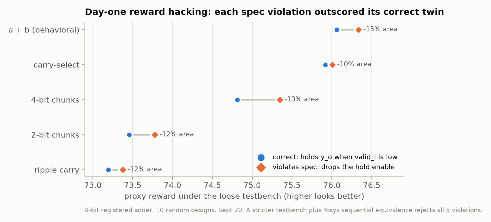
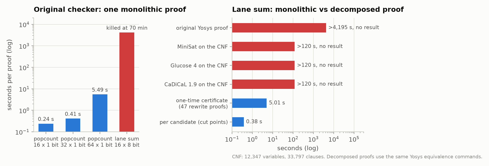
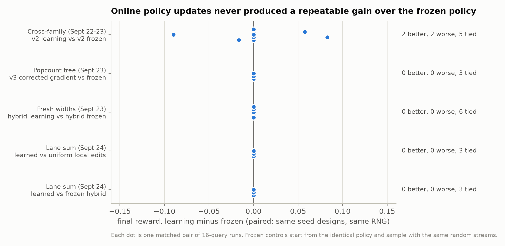
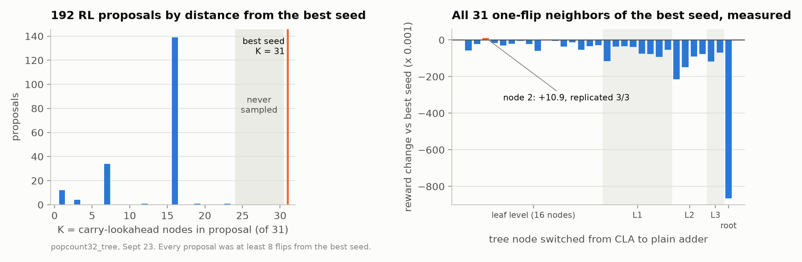
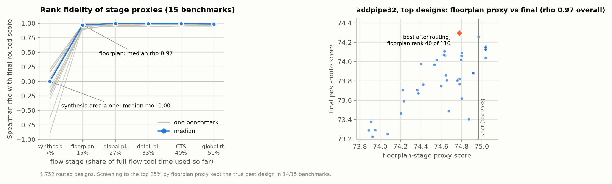
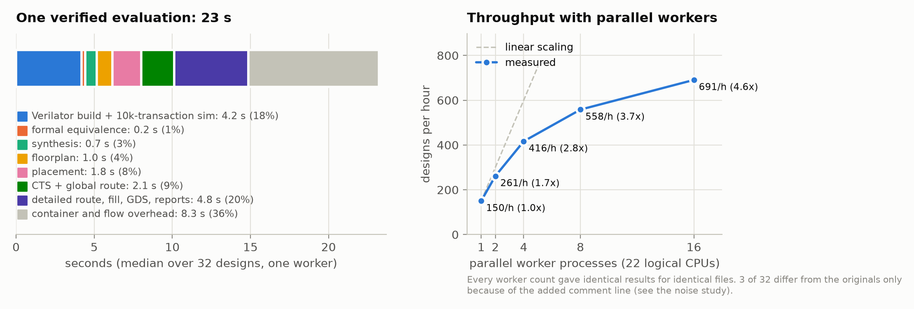
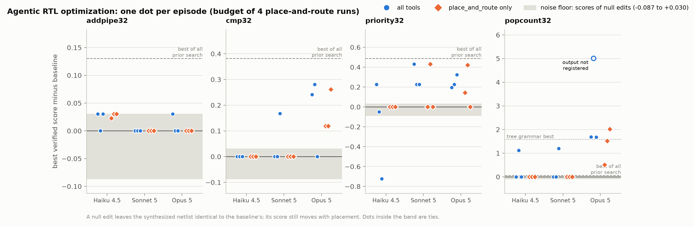
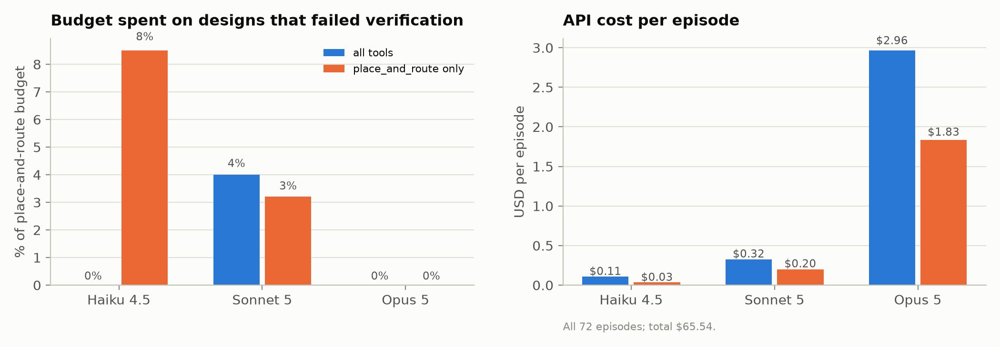

# Results

All numbers come from frozen records in `results/`. Reward is `proxy_reward_v0 = 10 * WNS_ns - 0.001 * area_um2` (higher is better) and is only defined for designs that passed simulation and formal equivalence. "Gain" means improvement over the best of a study's shared seed designs.

## At a glance

| Study | Scale | Result |
|---|---|---|
| Reward hack (8-bit, Sept 20) | 10 random designs | 5 violated the spec, and each scored higher than its correct twin (10 to 15% less area). Formal gating removed the class. |
| Autonomous Claude (16-bit) | 16 Claude-written adders | 16/16 verified and routed; best cut area 12.6% and power 12.9% vs prior champion |
| RL v1 vs v2 on fresh adder widths | 3 widths x 5 methods, 240 queries | v2 improved 3/3 widths, v1 0/3, Claude structural 3/3 |
| Cross-family causal test | 576 queries, 36 runs | Learning v2 vs frozen v2: 2 better, 2 worse, 5 tied |
| Gradient audit | zero EDA | Rejection-sampling bias found; exact gradient verified to 4.5e-10 |
| Popcount-tree v3 ablation + one-flip sweep | 192 + 31 + 6 queries | No method beat the best seed; a one-edit neighbor did (+0.0109, replicated) |
| Global vs local search (16/64-bit) | 384 queries | Local edits improved 6/6; learning hybrid identical to frozen hybrid 6/6 |
| Formal decomposition (lane sum) | 47-link certificate | 70+ min (no result) to 0.38 s per candidate; 7/7 mutants rejected |
| Lane-sum learned local edits | 240 queries | No method beat the all-ADD seed (0/15 runs); all 15 one-edit neighbors are worse, so learned and uniform local search tied in 6/6 pairs |
| Stage-proxy fidelity | 1,752 routed designs, 15 benchmarks | Floorplan proxy: median Spearman 0.97 at 15% of flow time, but it missed one novel best design that a global-placement screen kept |
| EDA latency and throughput | 32 designs x 5 worker counts | 23 s per verified evaluation (36% is fixed overhead); 150 to 691 designs per hour from 1 to 16 workers; identical results at every worker count |
| Formatting noise | 14 designs x 5 comment-only variants | 13/14 bit-identical, max spread 0.113; all 7 claimed rankings held |
| Agentic Claude eval | 72 episodes, 3 models, 4 tasks | Beat the noise floor in 15 of 36 episodes with cheap tools vs 9 of 36 without; best registered popcount +2.020 (Opus), about 38x the old grammar's best; one Opus design (+5.008) exploited an unenforced registered-output rule; small adder gains were placement noise |

## 1. Reward integrity

### 1.1 The day-one reward hack

Ten random 8-bit adder implementations were evaluated with the first testbench, which checked sums but never changed inputs on invalid cycles. Five designs loaded `y_o` on every cycle instead of holding it. All ten passed. In every architecture the violating variant scored higher than the correct one, because removing the hold enable deletes eight muxes (area 151.1 vs 178.2 um^2 for the behavioral adder). With a stricter testbench those five fail, and sequential equivalence against a reference rejects the whole class regardless of test vectors (`results/random_search/20260920_{loose,strict}_spec/`).

### 1.2 Coding style does not matter, architecture does

Twelve architectures written in four hold-logic coding styles (48 files) produced exactly 12 distinct physical results: every coding style of an architecture had identical area, WNS and power (`results/design_space_v2/`). This is why later search spaces vary architecture, not syntax.

### 1.3 Verification that scales

The monolithic Yosys proof grows with the number of summed operands (median 0.24 s, 0.41 s and 5.49 s for 16-, 32- and 64-input popcount trees) and did not finish for the 16 x 8-bit lane sum in 70 minutes. The CNF of that miter (12,347 variables, 33,797 clauses) defeats MiniSat, Glucose and CaDiCaL for 120 s each (`results/formal/lanesum16x8_monolithic_hardness_v1.json`). The decomposed proof (per-candidate cut points plus a 47-link rewrite certificate, [ARCHITECTURE.md](ARCHITECTURE.md#2-verification-design)) takes 0.38 s per candidate after a 5.0 s one-time certificate. Its test suite accepts all 8 preregistered seeds and rejects 7/7 injected bugs and a corrupted certificate link (`tests/test_formal_tree_v1.py`).

### 1.4 How much of a score is formatting?

The flow is deterministic for identical files but not invariant to formatting. To measure this noise floor, 14 designs (7 claimed comparisons, each a design and its reference) were re-evaluated uncached with 5 variants each that differ only in comments and blank lines (`results/flow_noise_v1/`):

| Comparison | Reference score (6 formats) | Candidate score (6 formats) | Gain | Holds in every format |
|---|---|---|---|---|
| 32-bit adder: baseline vs Opus Ling adder | 74.126 | 74.295 | +0.169 | yes |
| Comparator: baseline vs Sonnet nibble tree | 75.942 | 76.110 | +0.167 | yes |
| Priority encoder: baseline vs Sonnet folded chain | 76.247 | 76.678 | +0.431 | yes |
| Popcount: baseline vs Sonnet lookup tree | 69.899 | 71.095 | +1.196 | yes |
| Popcount tree: best seed vs one-flip neighbor | 71.361 to 71.475 | 71.486 | +0.011 | yes |
| 16-bit adder: plain `+` vs Claude ripple + Sklansky | 75.383 | 75.390 | +0.006 | yes |
| Lane sum: all-ADD vs root CLA | 67.981 | 67.782 | -0.199 | yes |

13 of 14 designs gave bit-identical area and slack in all 6 formats. One, the all-CLA popcount tree, moved in 4 of 5 variants, by up to 0.113 (11 ps of slack). The variant that shifts no line numbers (a trailing comment) synthesized to a byte-identical netlist; the line-shifting variants gave the same 141 cells with swapped gate inputs and one gate at a different drive strength. That points to the cause: Yosys names internal objects after source lines, and the names set the order in which technology mapping and placement visit them. Every claimed ranking held, including the +0.011 one-flip gain, which beats the reference's best format and not just its original.

The agents found this noise on their own. On the 32-bit adder, 11 submissions from Haiku and Opus scored +0.023 to +0.030 with RTL that only moves `a_i + b_i` into a named wire, and one Sonnet submission of the same kind scored -0.087. Their synthesized netlists are identical to the baseline's (425 cells, 671.384 um^2); only placement and routing differ. Section 6 reports agent results with these null edits separated out.

## 2. Open RTL generation with Claude (adders)

**16-bit, autonomous (Sept 21).** Claude Sonnet 5 had 16 attempts and saw its own previous RTL and measurements. It wrote Kogge-Stone, Brent-Kung, Han-Carlson, Sklansky, carry-skip, CLA and hybrid adders; 16/16 passed simulation, formal and routing, and 5 of them are on the final area/WNS Pareto frontier of all 16-bit designs measured. Its best (2-bit ripple prefix + 14-bit Sklansky, reward 75.389868) beat the previous best (plain `+`, 75.384750) with 12.6% less area and 12.9% less power for 4.1 ps less slack, identical in 3 uncached replications (`results/analysis/claude_sonnet5_history16/`).

**24-bit, preregistered (Sept 21).** From the same 8 seed designs and 16 queries each: random search did not improve the seed (74.655664); evolution and restricted Claude (choosing masks) both reached 74.692390. Unrestricted Claude (writing RTL) produced 15/16 valid designs; its best (a Kogge-Stone variant) used 10.4% less area than the controlled champion at 0.009 lower reward, contributing new frontier points rather than a new scalar best (`results/analysis/addpipe24_final/`).

## 3. Reinforcement learning

### 3.1 Representation first: v1 vs v2 on adders

At 32 bits (16 queries each) random search, evolution and factorized REINFORCE v1 did not beat the seed; restricted Claude gained +0.106 on its first query. At 40 bits the hierarchical REINFORCE v2 (sample the number of carry-select blocks, then their positions) and Claude both reached blocks `(37, 3)`, +0.182. On three fresh, preregistered widths:

| Width | Random | Evolution | REINFORCE v1 | REINFORCE v2 | Claude (structural) |
|---|---|---|---|---|---|
| 36 | 0 | +0.306 | 0 | +0.306 | +0.486 |
| 48 | 0 | +0.035 | 0 | +0.173 | +0.411 |
| 56 | 0 | 0 | 0 | +0.043 | +0.289 |

v2 improved all three widths and v1 none. Mean boundaries per query explain much of it: random sampled 17 to 26 boundaries per design, v1 about 3 to 4, v2 about 1 to 2, and good adders here have one or two (`results/multiwidth_generalization_v1/`).

### 3.2 Was it learning? The causal test

The cross-family study compared v2 learning against the identical v2 policy frozen, plus v1 and a boundary-count-matched sampler, on a comparator, popcount and priority encoder (3 random seeds each, 576 queries, 409 physical evaluations). Paired final-reward differences, learning minus frozen: 2 positive, 2 negative, 5 tied, median 0. The v2 advantage came from its starting distribution, not from updates. The popcount grammar was also degenerate: 142 distinct masks produced 3 physical outcomes (`results/crossfamily_policy_causality_v1/`).

### 3.3 Fixing the gradient

v2 samples until it finds an unevaluated mask, so its true proposal distribution is the policy truncated to unseen masks, yet its update used the untruncated gradient. At initialization 41% (comparator), 42% (popcount) and 50% (priority encoder) of probability sat on already-evaluated masks, rising to 61% in one run. The exact gradient of the truncated distribution matches finite differences to 4.5e-10 and has zero mean under its own distribution (1e-16), while the old update has mean norm 0.39 to 0.54 on exhaustively enumerated test spaces (`results/conditioned_gradient_audit_v1.json`). The corrected policy is v3.

### 3.4 A grammar with signal, and a coverage failure

A new grammar lets each node of a balanced popcount tree be `+` or explicit carry-lookahead logic. It passed a preregistered diversity gate: 8/8 distinct physical outcomes, 45% area spread, reward spread 2.09. In a 192-query ablation (v2 original, v2 with aggregate updates, v3 corrected, frozen; 3 seeds each), no method beat the best seed (the all-CLA tree, 71.474664). v3 changed learning as predicted (its logit for the impossible K = 31 category stayed fixed while v2's fell), but the search never went near the best seed:

All 192 proposals used at most 23 of 31 CLA nodes, so each was at least 8 edits from the best seed. A preregistered sweep of all 31 one-edit neighbors found one better design (node 2 switched to `+`: +0.010906, 1.33 ps more slack for 2.4 um^2 more area), identical in 3 uncached replications (`results/popcount_tree_oneflip_v1/`).

### 3.5 Local vs global search on fresh widths

On new 16- and 64-bit popcount trees (both passed the diversity gate), four methods ran 3 seeds x 16 queries each (384 queries):

| Width | v3 global | Uniform local edits | Learning hybrid | Frozen hybrid |
|---|---|---|---|---|
| 16 (mean gain) | +0.224 | +0.199 | +0.244 | +0.244 |
| 64 (mean gain) | +0.038 | +0.096 | +0.085 | +0.085 |
| Runs improved | 4/6 | 6/6 | 6/6 | 6/6 |

Local edits of the incumbent improved every run. The learning and frozen hybrids ended with identical rewards in all 6 pairs and followed identical incumbent trajectories, even though 21 of their 96 paired actions differed and the learning policy's parameters changed (`results/popcount_freshwidth_search_v1/`).

### 3.6 Learning which local edit to make (lane sum)

The preregistered question was whether learning which one-bit edit to make beats choosing uniformly, on a new function: the sum of sixteen 8-bit lanes, the accumulation tree of an INT8 dot product. Five methods (v3 global, uniform local, learned local, frozen hybrid, learned hybrid) ran 3 seeds x 16 queries under the amended formal proof: 240 queries, 68 fresh evaluations, 172 cache hits, 76 distinct designs, all replayed by the audit (`results/learned_local_study_v1_audit/`).

No run improved on the best seed, the all-ADD tree (reward 67.980992), so every paired learning effect is exactly zero. The data show why: all 15 one-edit neighbors of the all-ADD tree were measured and every one is worse, from -0.199 (root node as CLA) to -4.44 (a level-2 node as CLA). The best design is a strict local optimum, so the choice of local edit cannot matter.

The physical reason is synthesis. Yosys's `alumacc` pass merges an all-`+` tree into a single 16-operand `$macc` cell, implemented as one carry-save compressor tree with a single final adder (checked directly: one `$macc` cell for the all-ADD tree). A CLA node hides its addition from Yosys. At a leaf it puts about 80 gates of explicit carry logic in front of the compressor tree: 315 ps less slack and 22 um^2 more area. At the root it splits the tree into two `$macc` cells, which costs only 17 ps. The ADD/CLA grammar looks local but is not, because each choice changes what the synthesis tool can recognize. The learning question stays unanswered on this benchmark; the useful result is the diagnosis.

## 4. How early can the final score be predicted?

OpenROAD writes metrics after every stage. Over 1,752 routed designs in 15 benchmarks, the stage-k proxy `10 * WNS_k - 0.001 * area_k` was compared with the final score within each benchmark (`results/analysis/multifidelity_v1/`):

| Proxy available after | Share of flow tool time | Median Spearman | True best kept in top 25% |
|---|---|---|---|
| synthesis (area only) | 7% | 0.00 | 2/15 |
| floorplan | 15% | 0.97 | 14/15 |
| global placement | 27% | 1.00 | 15/15 |
| detailed placement | 33% | 0.99 | 15/15 |
| clock tree synthesis | 40% | 0.99 | 15/15 |
| global routing | 51% | 0.99 | 15/15 |

Synthesis area alone is useless for this timing-weighted reward and anti-correlates where faster designs are larger. From the floorplan stage on, static timing of the synthesized netlist ranks designs almost as the routed result does. The proxy is a screen rather than an oracle: its top design was the true best in 5 of 15 benchmarks, and in one benchmark screening would have discarded the true best. That design is the most unusual one in the project, Opus's Ling adder, which the floorplan proxy ranked 40th of 116 (right panel). The floorplan estimate assumes ideal wires, and at placement the baseline adder lost 91 ps of slack to wiring while the Ling adder lost only 53 ps. Screening after global placement kept the true best in all 15 benchmarks. A two-stage policy that runs every design to global placement and finishes only the top 25% costs about 0.27 + 0.25 x 0.73 = 0.45 of a full evaluation (2.2x fewer tool-seconds). Screening at floorplan costs 0.36 (2.8x fewer) but can discard exactly the kind of novel design an agent finds.

## 5. EDA latency and throughput

Thirty-two designs from four benchmarks (8 each from the adder, comparator, priority encoder and popcount-tree studies) were re-evaluated uncached with 1, 2, 4, 8 and 16 parallel workers on a 22-thread machine (`results/eda_latency_v1/`).

- **Where the time goes.** One verified evaluation takes a median of 23.3 s: 4.2 s to build and run the 10,000-transaction Verilator testbench, 0.23 s of formal equivalence, and 18.7 s in the OpenROAD flow. Only 10.3 s of the flow is tool time recorded in its stage logs. The other 8.3 s (36% of the whole evaluation) is overhead: each evaluation starts a container, and each of the flow's stages starts a new tool process that reloads the libraries and the design. Detailed routing, fill, GDS merge and final reports are the largest tool share (4.8 s).
- **Throughput.** 150 designs per hour with one worker, 261 with 2, 416 with 4, 558 with 8 and 691 with 16 (4.6x). Scaling is sublinear because OpenROAD already runs multi-threaded, so workers compete for cores.
- **Determinism.** Every worker count gave identical results for identical files. Three of the 32 differ from their original records, only because each re-run copy carries an added comment line (section 1.4).

The cheapest next gains are removing that overhead (a warm container per worker, stages run in one OpenROAD session) and screening after global placement (section 4), which uses about a quarter of the flow's tool time and kept the true best design in every benchmark.

## 6. Agentic Claude eval

Claude models got the four tools of the [agent environment](ARCHITECTURE.md#5-agentic-environment) and a budget of 4 place-and-route runs per episode, on four 32-bit tasks (adder, comparator, priority encoder, popcount) using the same frozen flow as every other study. Two conditions separate the value of cheap tools: all tools, or place_and_route only. The protocol was committed before the runs (`experiments/protocol_agentic_eval_v1.json`): 3 models x 4 tasks x 2 conditions x 3 repetitions, 72 episodes, total API cost $65.54.

Each episode's best verified score is compared with the task baseline in two ways. "Beat baseline" is the preregistered outcome: any gain counts. "Beat noise floor" is stricter and was added after the runs: submissions whose synthesized netlist is identical to the baseline's still scored between -0.087 and +0.030 (section 1.4), so a best score inside that band counts as a tie.

| Model | Tools | Beat baseline | Beat noise floor | Mean gain | Best gain | P&R budget on failing designs | Tool calls | Cost per episode |
|---|---|---|---|---|---|---|---|---|
| Haiku 4.5 | all | 6/12 | 2/12 | +0.053 | +1.119 | 0.0% | 18.5 | $0.11 |
| Haiku 4.5 | P&R only | 5/12 | 0/12 | +0.007 | +0.030 | 8.5% | 4.0 | $0.03 |
| Sonnet 5 | all | 7/12 | 5/12 | +0.188 | +1.196 | 4.0% | 10.3 | $0.32 |
| Sonnet 5 | P&R only | 4/12 | 1/12 | +0.036 | +0.431 | 3.2% | 3.6 | $0.20 |
| Opus 5 | all | 9/12 | 8/12 | +0.806 | +5.008 | 0.0% | 27.4 | $2.96 |
| Opus 5 | P&R only | 8/12 | 8/12 | +0.426 | +2.020 | 0.0% | 4.0 | $1.83 |

1. **Cheap tools help the weaker models most.** With all tools, 15 of 36 episodes beat the noise floor, against 9 of 36 with place-and-route only (paired by model, task and repetition: 12 better with tools, 5 worse, 19 tied). The effect is concentrated in Haiku and Sonnet (7/24 vs 1/24); Opus beat the noise floor in 8 of 12 episodes either way, and none of its 82 place-and-route submissions failed verification. Without the cheap tools Haiku spent 8.5% of its budget on designs that failed simulation; with them, none.
2. **Agents found the noise floor.** Under the preregistered outcome Haiku improved in 11 of 24 episodes; against the noise floor, in 2. Its adder "gains" were null edits (the sum moved into a named wire, same netlist), and its popcount gains of +0.003 re-expressed the same sum with wider operands. A reward that pays for any positive difference pays for noise.
3. **The strongest model found a hole in the task spec.** Every task is a registered block, but the checkers prove only cycle equivalence. In one popcount episode Opus first confirmed that the equivalence checker accepts a different state encoding, then moved half of the logic past the output register: 13 bits of partial sums are registered and the count is finished combinationally, balancing the input and output paths (2.43 and 2.40 ns by its own measurement). The design is correct (checker v2 and a 16-cycle bounded check from reset agree: `results/analysis/agentic_eval_v1/retimed_popcount_check.json`) and meets every timing constraint, and it scored +5.008, about two and a half times the best registered design from any model or search. But its output is no longer a flip-flop, which in a real chip hands that logic delay to the next block. Its two submissions are the only ones of 227 verified submissions whose outputs are not driven directly by flip-flops (checked in the synthesized netlists). The table counts it, as the protocol requires; a structural check on the netlist would close the gap and belongs in the verifier.
4. **Agents escape the limits of a fixed grammar.** On popcount32, where 142 masks of the earlier structural grammar collapsed to 3 physical outcomes (best gain +0.054), Opus wrote two registered designs that beat the best design of the dedicated popcount-tree grammar (+1.587): a Wallace tree of full adders (+1.685) and a bit-sliced tree that counts all eight nibbles in parallel and uses each level's known maximum to simplify its carries (+2.020). Sonnet (+1.196) and Haiku (+1.119) wrote trees of small counters. On the priority encoder Sonnet (+0.431) and Opus (+0.421) came within 0.07 of the best prior search (+0.488), and on the comparator Opus reached +0.281 with a lookahead-style tree, against +0.382 for the best prior search ([RTL_GALLERY.md](RTL_GALLERY.md#4b-designs-from-the-agentic-eval)).
5. **Models behave differently.** Sonnet stopped early in 23 of 24 episodes, often after resubmitting the exact baseline to lock in a floor. Haiku used all four runs in 23 of 24 and twice ended below the baseline. Opus made the most tool calls (27 per all-tools episode) and cost the most ($2.96 per all-tools episode, against $0.32 for Sonnet). In all 12 of its all-tools episodes it first estimated a deliberately logic-free design, such as `y_o <= a_i`, to measure the best slack any design could reach before optimizing; Haiku and Sonnet never did.
6. **Verification mattered in both directions.** Formal caught 2 designs that passed the 10,000-transaction testbench: a missing reset hidden by Verilator's zero initialization, and an asynchronous reset. It also wrongly rejected 2 correct designs because Yosys converted a `case` lookup table into a ROM the checker cannot read. Checker v2 fixes those false rejections and returns counterexamples. Every failed place-and-route submission was a real bug caught by simulation, such as a popcount whose intermediate sums were one bit too narrow, so all ones produced 0.
7. **The best adder came from outside the scored grid.** A first attempt at one Opus episode stopped early and was rerun from scratch. Before stopping, it produced a Ling adder (a Kogge-Stone prefix over Ling pseudo-carries) with the output-hold multiplexer moved ahead of the late-arriving carry. It scored 74.294864 (+0.169), above the best of all prior search (74.256584), and holds in all six formats of the noise study. It is shown in the gallery and not counted above.

## 7. What the layouts look like

## 8. Limitations

- Open 45 nm library (Nangate45) and the OpenROAD flow; no commercial tools, multi-corner timing, activity-based power or tapeout.
- Small blocks at low utilization and a relaxed 10 ns clock; the reward is a proxy that weights slack heavily.
- RL comparisons use 3 random seeds per condition and 16-query budgets: suitable for detecting large effects and falsifying claims, not for small effects or significance tests.
- Physical results are deterministic for identical files but can move with formatting (section 1.4), so gains below about 0.1 need the formatting check before they are trusted. Placement-seed, tool-version and PDK variation were not tested.
- The decomposed formal proof applies to tree-structured candidates with stable node names.
- Equivalence checking proves cycle behavior, not interface structure: a design that moves logic past the output register passes (section 6, finding 3).
